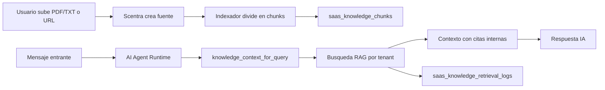

# Fase 8 - Knowledge Base RAG operativo

## Objetivo

Convertir la seccion Knowledge Base en un motor RAG usable por los agentes de Scentra, con indexacion por fragmentos, busqueda contextual, diagnostico de salud y trazabilidad de recuperaciones.

## Implementado

- Tabla `saas_knowledge_chunks` para partir fuentes en fragmentos reutilizables.
- Tabla `saas_knowledge_retrieval_logs` para auditar consultas RAG, resultados y score superior.
- Metadata de indexacion en `saas_knowledge_sources`:
  - `content_hash`
  - `chunk_count`
  - `last_indexed_at`
  - `expires_at`
  - `error`
- Indexacion automatica al subir archivo o agregar URL.
- Endpoint de busqueda RAG:
  - `POST /saas/v1/knowledge/search`
- Endpoint de salud:
  - `GET /saas/v1/knowledge/health`
- Reindexado por fuente:
  - `POST /saas/v1/knowledge/sources/{source_id}/reindex`
- Reindexado global por tenant:
  - `POST /saas/v1/knowledge/reindex`
- Integracion de la IA conversacional con `knowledge_context_for_query`.
- UI para:
  - ver estado RAG
  - ver cantidad de chunks
  - probar busquedas RAG
  - reindexar una fuente
  - reindexar todas las fuentes
  - ver errores de indexacion

## Flujo

## Multi-tenant

Todas las consultas filtran por `tenant_id`. Una empresa solo recupera fuentes, chunks y logs de su propio tenant.

## Validaciones recomendadas despues del redeploy

1. Subir un TXT pequeño con politicas de envio.
2. Revisar que la fuente quede `active` y con `chunk_count > 0`.
3. Buscar una pregunta desde `Ajustes > IA > Knowledge Base`.
4. Verificar que aparezcan fragmentos y score.
5. Enviar una pregunta por WhatsApp/Instagram relacionada con esa fuente.
6. Revisar que el agente responda usando la informacion del documento.

## Pendiente futuro

- Embeddings vectoriales reales con pgvector para busqueda semantica avanzada.
- Re-crawl automatico de URLs con expiracion.
- Versionado de documentos.
- Prioridad por fuente.
- Adjuntar citas visibles al usuario final cuando el agente responda.
- Panel de calidad RAG con tasa de respuestas sin contexto.
